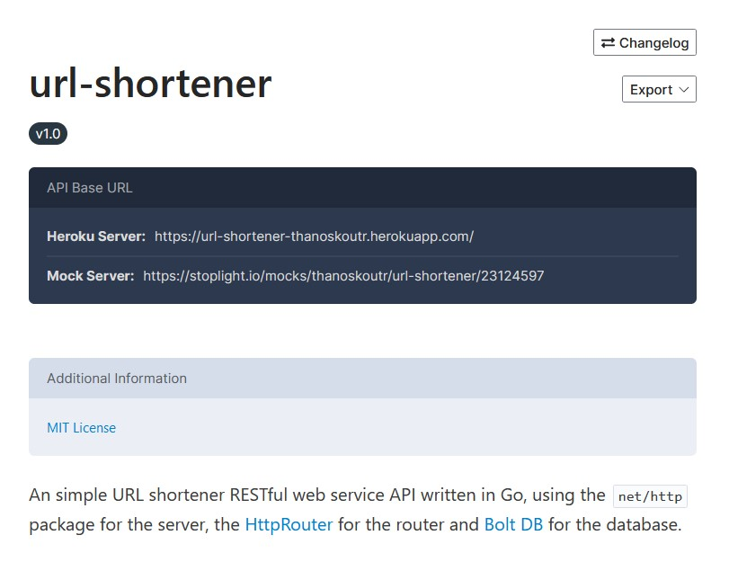

# url-shortener

## About

An simple URL shortener RESTful web service API written in Go, using the `net/http` package for the server, the [HttpRouter](https://github.com/julienschmidt/httprouter) for the router and [Bolt DB](https://github.com/boltdb/bolt) for the database.

**Deployed on [Heroku](https://www.heroku.com), access it on [url-shortener-thanoskoutr.herokuapp.com](https://url-shortener-thanoskoutr.herokuapp.com)**



_See [below for API Documentation](#api-specification)_

## Usage

### Run service

To run the web service:

```bash
$ git clone https://github.com/thanoskoutr/url-shortener.git
$ cd url-shortener
$ go run main.go

Starting the server on :8080
```

### Build executable

To build and run the web service as an executable:

```bash
$ go build
$ ./url-shortener

Starting the server on :8080
```

### Call the API

Shorten a URL:

```bash
$ curl -X POST http://localhost:8080/shorten -d '{"long_url":"https://www.github.com"}'

{"long_url":"https://www.github.com","short_url":"GJWrQa0"}
```

Access the URL you shortened from the following new URL:

```bash
$ curl http://localhost:8080/redirect/GJWrQa0

<a href="https://www.github.com">Moved Permanently</a>.
```

## Testing

To run the tests for all subpackages (recursively):

```bash
$ go test -v ./...
```

## Dependencies

To fetch the dependencies from `go.mod`:

```bash
$ go mod download
```

To create the `go.mod` from scratch (only for dev purposes), run:

```bash
$ go mod init github.com/thanoskoutr/url-shortener
$ go get github.com/boltdb/bolt
$ go get github.com/julienschmidt/httprouter
$ go get github.com/rs/cors
$ go mod tidy
```

## Deployment

For instruction on how to deploy this Go web service (or any other Go app) for free on a Platform as a Service cloud provider like Heroku, see the [Heroku Deployment Guide](Heroku.md).

## Features

- Create Short URL from Long URL (`/shorten` endpoint)
  - Get a Long URL from user, as a JSON body parameter
  - Use encoding algorithm (MD5 Hash and base64 encoding)
  - Save (Short URL, Long URL) key-value pair in Database
  - Return Short URL as a JSON response to the user
- Redirect server (`/redirect/:short_url` endpoint)
  - If `:short_url` parameter is not empty, redirect to saved Long URL on Database
  - If `:short_url` parameter is empty, redirect to Home page (`/`)

## API Specification

You can find the [API Documentation on Spotlight](https://thanoskoutr.stoplight.io/docs/url-shortener/).

Contains:

- API Documentation.
- Ability to make calls to the API Endpoints of the service.

## BoltDB Web Interface

We can inspect the BoltDB database in the browser using the `boltdbweb` tool.

To install it globally (usually in the `~/go/bin` folder in your system), run:

```bash
go install github.com/evnix/boltdbweb@latest
```

Usage:

```bash
boltdbweb -d urls.db -p 8081
```

- `--db-name`: The file name of the DB.
  - NOTE: If `file.db` does not exist. it will be created as a BoltDB file.
- `--port`: Port for listening on... (Default: `8080`)

### BoltDB Web Interface


## URL Shortening Techniques

### Bases

- `base58`: `[1-9]][a-k][m-z][A-H][J-N][P-Z]`
- `base62`: `[0–9][a-z][A-Z]`
- `base64`: `[0–9][a-z][A-Z][+/]`
- `base64`: `[0–9][a-z][A-Z][-_]` _(URL and Filename safe)_

```
123456789ABCDEFGH JKLMN PQRSTUVWXYZabcdefghijk mnopqrstuvwxyz
= 58 characters = base58

0123456789ABCDEFGHIJKLMNOPQRSTUVWXYZabcdefghijklmnopqrstuvwxyz
= 62 characters = base62

0123456789ABCDEFGHIJKLMNOPQRSTUVWXYZabcdefghijklmnopqrstuvwxyz+/
= 64 characters = base64

0123456789ABCDEFGHIJKLMNOPQRSTUVWXYZabcdefghijklmnopqrstuvwxyz-_
= 64 characters = base64 (URL and Filename safe)
```

##### base62

Number of possible short URLs using `base62` and No of characters:

- 6 characters short URL: `62^6 = ~56.8` billion possible URLs
- 7 characters short URL: `62^7 = ~3.52` trillion possible URLs
- 8 characters short URL: `62^8 = ~218` trillion possible URLs

##### base64

Number of possible short URLs using `base64` and No of characters:

- 6 characters short URL: `64^6 = ~68.7` billion possible URLs
- 7 characters short URL: `64^7 = ~4.4` trillion possible URLs
- 8 characters short URL: `64^8 = ~281` trillion possible URLs

### Techniques

- Short URL from random numbers
- Short URL from hashing (MD5, SHA1, SHA256)
- Short URLs from base conversion (from `base10` to `base62`)
- Key Generation Service (KGS)

#### Implementated Technique

Source Code in `shortener/shortener.go`, function `Encode`:

- Add scheme to URL if not provided (`http://`, `https://`)
- Get the MD5 Hash of the URL
- Encode the Hash to Base 64 _(URL and Filename safe)_
- Keep the first 7 characters of the encoded string

## Improvements

### Technical

- ROUTER:
  - Add `/delete` route, to delete key-value entry
  - Add `/show-all` route, to show all key-value entry
- DB:
  - Make Batch Writes on Database
- ROUTER & DB:
  - Add goroutines / enable parallel execution of handlers
- CLI:
  - Add command line flag (or/and route) for accepting key-value entries from JSON/YAML file
  - Add command line flag (or/and route) for exporting key-value entris in JSON/YAML file
- TEST:
  - Unit Testing & End-to-End Testing
  - Handlers, API Endpoints, Shortener, Database, Main
- REDIRECTS:
  - Change redirect route endpoint from `/redirect` to `/r`
  - Change shorten route endpoint from `/shorten` to `/s`
  - Change HTTP Status Code 301 -> 302 (?)
  - Redirect to home page on redirection errors
- SHORTENER:
  - Change encoding to `base62` or `base58`
  - Change shortening technique to more robust (base conversion, KGS)
  - Fix collision errors on same key (`short_url`), keep the next 7 characters (shift by one) -> Repeat until there is no match in DB
- CONFIG:
  - Implement accepting config file for constants and globals.
  - flag names, port, log file name, database file name, bucket name
- CACHE:
  - Cache results (minimize database reads)
  - Add Redis
  - Make reads buffered (and not transfer all contents into memory)
- FRONTEND:
  - Add frontend (Vanilla, React, Next.js, Gatsby, Tailwind) to support the backend service
- DEVOPS:
  - Add Dockerfile and containerize the application.
  - Make application a Go module/package/CLI.
  - Generate Documentation from source files.
  - Calculate required bandwidth/storage/traffic for API.
  - Deploy BoltDB with app (for persistance storage).

### Features

- Short URL lifetime (24 hours)
- Count short URL clicks
- User Auth
- Quota / API Key
- Calculate
